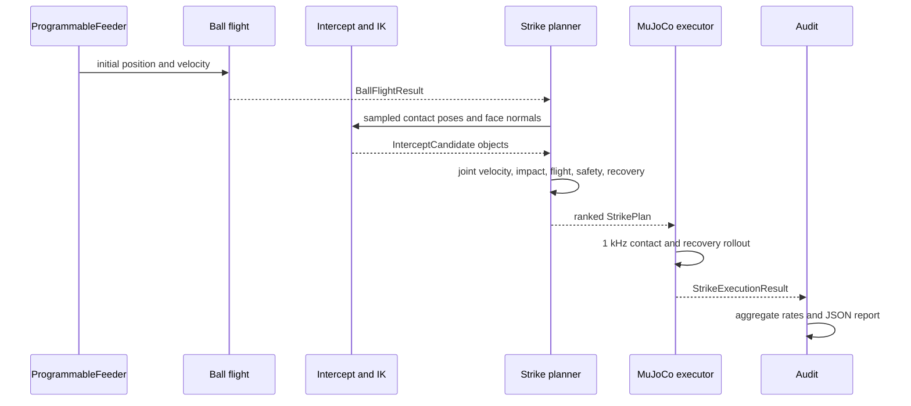
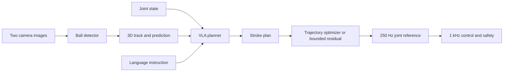

# System architecture

This guide explains the repository as it exists today: what each component
does, the main mathematics behind it, and how data moves between components.
For milestone status and future work, see the [project plan](tennis_vla_plan.md).

## What is implemented

The repository currently contains two engineering tracks:

1. a tennis simulator, visual dataset, and learned ball detector; and
2. a privileged strike oracle that reads exact simulated ball state, plans a
   swing, executes it in MuJoCo, and scores the return.

These tracks are not yet joined. The strike oracle does not consume detections
from the learned vision system, and there is no trained tennis VLA or RL policy.
The intended progression is

$$
\text{physics} \rightarrow \text{oracle demonstrations}
\rightarrow \text{behavior-cloned VLA} \rightarrow \text{residual RL}.
$$

## System at a glance

```mermaid
flowchart LR
    F[Programmable feeder] --> BF[Ball flight]
    BF --> R[MuJoCo stereo rendering]
    R --> DS[Flight dataset]
    DS --> HD[Heatmap detector]
    HD --> ST[Stereo triangulation and tracking]

    BF -->|exact state: current oracle| IK[Intercept and IK]
    ST -.->|estimated state: future integration| IK
    IK --> SP[Strike search]
    SP --> JT[Joint trajectory]
    JT --> EX[MuJoCo execution]
    EX --> SC[Contact, landing, recovery, safety scores]
    SC --> AU[Audits and reports]
    AU -.->|future demonstrations| VLA[Behavior-cloned VLA]
    VLA -.-> RL[Residual SAC]
    RL -.-> JT

    classDef planned stroke-dasharray: 6 4,fill:#f6f6f6;
    class VLA,RL planned;
```

Solid arrows are implemented paths. Dashed arrows are planned integrations.

## Coordinates, units, and rates

The world frame is shared by physics, perception, and planning:

- $x$: along the court, with the net at $x=0$;
- $y$: lateral across the court;
- $z$: upward;
- positions: metres;
- linear velocities: metres per second;
- joint positions: radians;
- joint velocities: radians per second.

The ball machine starts on the $+x$ half and sends the ball toward the robot on
the $-x$ half. A legal return travels back toward $+x$.

| Layer | Rate | State |
| --- | ---: | --- |
| MuJoCo physics and safety measurements | 1 kHz | implemented |
| Joint trajectory reference | 250 Hz | implemented |
| Strike policy update | 50 Hz | planned runtime layer |
| VLA stroke planner | 10 Hz | planned |

## Main data objects

The current oracle pipeline can be understood through five dataclasses:

| Object | Produced by | Contains | Consumed by |
| --- | --- | --- | --- |
| `Feed` | `ProgrammableFeeder` | initial ball position and velocity | flight simulation |
| `BallFlightResult` | analytical or MuJoCo flight | sampled ball states, net crossing, first bounce, outcome | intercept and return planning |
| `InterceptCandidate` | kinematic search | contact time, ball state, racket target, IK solution | strike search |
| `StrikePlan` | strike search | contact state, racket velocity, joint trajectory, predicted return | execution |
| `StrikeExecutionResult` | live MuJoCo rollout | measured contact, outgoing ball, controller limits, recovery, pass/fail reasons | audits and reports |

The perception track uses `BallDetection`, `TriangulatedBall`, and
`BallTrackEstimate`. These types currently end at evaluation; they do not feed
`InterceptCandidate` yet.

## Components

### 1. Court, robot, and integrated environment

[`court.py`](../tennis_vla/court.py) defines regulation court dimensions, the
laterally varying net height, and line calls. A ball that overlaps a singles
line is considered in.

[`arm.py`](../tennis_vla/arm.py) loads the pinned Sawyer model from MuJoCo
Menagerie, attaches the racket geometry, defines the ready configuration, and
provides a sampled workspace audit.

[`environment.py`](../tennis_vla/environment.py) combines the arm, racket,
court, net, free ball, contact pairs, actuators, and two fixed cameras into one
`mujoco.MjModel`. Rendering, planning, execution, and tests use this common
model. Court contact parameters are calibrated against the independent
analytical flight model.

### 2. Feeder and ball flight

[`feeder.py`](../tennis_vla/feeder.py) samples deterministic initial conditions
from a configured envelope. It uses rejection sampling until the analytical
flight produces a legal first bounce. The same seed therefore produces the
same legal feed.

[`ballistics.py`](../tennis_vla/ballistics.py) models gravity and quadratic
drag without spin. For ball position $\mathbf p$ and velocity $\mathbf v$,

$$
\dot{\mathbf p}=\mathbf v,
\qquad
\dot{\mathbf v}=\mathbf g-k\lVert\mathbf v\rVert\mathbf v,
$$

where

$$
k=\frac{\rho C_D\pi r^2}{2m},
\qquad
\mathbf g=\begin{bmatrix}0&0&-9.81\end{bmatrix}^{\mathsf T}.
$$

The implementation integrates this ordinary differential equation with RK4 at
1 ms intervals. At a court bounce it applies

$$
v_z^+=-e_zv_z^-,
\qquad
\mathbf v_{xy}^+=r_{xy}\mathbf v_{xy}^-,
$$

with vertical restitution $e_z=0.74$ and horizontal retention $r_{xy}=0.82$.
The result also records net clearance, bounce location, and whether the first
bounce is legal.

[`execution.py`](../tennis_vla/execution.py) provides a second flight path,
`simulate_mujoco_ball_flight`, that applies the same drag as an external force
while MuJoCo resolves court and net contacts. Active audits use this calibrated
rollout for the incoming feed and intercept search. The planner uses the faster
analytical model to screen candidate outgoing returns, while live execution
provides the measured contact result.

### 3. Racket impact

[`impact.py`](../tennis_vla/impact.py) contains a first-order impact map used to
screen strike candidates and validate MuJoCo contact. Let
$\mathbf v_b^-$ be incoming ball velocity, $\mathbf v_r$ racket velocity, and
$\mathbf n$ the unit racket-face normal. Relative incoming velocity is

$$
\mathbf u^-=\mathbf v_b^- - \mathbf v_r.
$$

Split it into normal and tangential parts:

$$
u_n=\mathbf u^-\cdot\mathbf n,
\qquad
\mathbf u_t=\mathbf u^- - u_n\mathbf n.
$$

For an approaching ball, $u_n<0$. The outgoing velocity is

$$
\mathbf v_b^+=\mathbf v_r+r_t\mathbf u_t-e_nu_n\mathbf n,
$$

where $e_n=0.78$ is normal restitution and $r_t=0.82$ retains tangential
speed. This model treats the racket as effectively massive and omits spin,
finite racket inertia, and string deformation.

### 4. Rendering, datasets, and domain randomization

[`domain_randomization.py`](../tennis_vla/domain_randomization.py) samples
court, line, ball, net, light, camera, exposure, noise, and gamma parameters
from a seed. It applies geometry and camera changes before rendering, then adds
sensor effects after rendering.

[`flight_dataset.py`](../tennis_vla/flight_dataset.py) generates
`tennis-flight-v0`. Each frame contains two RGB image paths and privileged
training labels: exact 3D ball position, velocity, bounce state, and time to a
reference strike plane. Motion blur is approximated by averaging three renders
within the exposure interval.

Train, validation, and test episodes use disjoint feeder seed ranges. The
validator checks manifest counts, split isolation, label shape, and every
referenced image. Privileged fields are labels and evaluation truth; they are
not intended as deployed policy inputs.

### 5. Visual ball detection and tracking

[`perception.py`](../tennis_vla/perception.py) contains both a color baseline
and the shared geometry. With vertical field of view $\theta$ and image height
$H$, the focal length in pixels is

$$
f=\frac{H/2}{\tan(\theta/2)}.
$$

A detected pixel $(u,v)$ is converted to the camera-frame direction

$$
\mathbf d_c=\begin{bmatrix}(u-c_x)/f_x & -(v-c_y)/f_y & -1\end{bmatrix}^{\mathsf T},
$$

then rotated into the world frame and normalized. For camera origins
$\mathbf o_1,\mathbf o_2$ and ray directions $\mathbf d_1,\mathbf d_2$,
triangulation solves

$$
\min_{s,t}\left\lVert
(\mathbf o_1+s\mathbf d_1)-(\mathbf o_2+t\mathbf d_2)
\right\rVert_2^2.
$$

The estimated ball position is the midpoint of the closest points. Their gap
is retained as a geometric consistency score.

A short temporal window fits constant velocity by least squares:

$$
(\hat{\mathbf p},\hat{\mathbf v})=
\arg\min_{\mathbf p,\mathbf v}
\sum_i\left\lVert
\mathbf p_i-\left(\mathbf p+\mathbf v(t_i-t_k)\right)
\right\rVert_2^2.
$$

The predicted crossing time of plane $x=x_*$ is

$$
t_*=t_k+\frac{x_*-\hat p_x}{\hat v_x},
$$

provided the crossing lies in the future.

[`learned_perception.py`](../tennis_vla/learned_perception.py) implements the
learned detector. It is a small fully convolutional network: pointwise RGB
projection, depthwise $5\times5$ spatial filtering, another pointwise layer,
and a one-channel heatmap head. It preserves image resolution because a distant
ball may occupy one pixel. The highest-probability heatmap cell becomes the
detected center.

Training uses a CenterNet-style focal heatmap loss. In simplified form,

$$
L_+=-\sum_{y=1}\log(p)(1-p)^2,
$$

$$
L_-=\operatorname{meanTopK}_{256}
\left[-\log(1-p)p^2(1-y)^4\right],
\qquad L=L_++L_-.
$$

Hard-negative mining prevents a few bright court or robot pixels from being
hidden by tens of thousands of easy background pixels.

### 6. Intercept search and inverse kinematics

[`intercept.py`](../tennis_vla/intercept.py) samples the post-bounce flight in a
bounded contact region. For ball center $\mathbf p_b$, ball radius $r$, racket
half-thickness $h$, and desired face normal $\mathbf n$, the racket-center
target is

$$
\mathbf p_r=\mathbf p_b-(r+h)\mathbf n.
$$

The IK task combines racket-center position error and face-normal error. If
$J_p$ and $J_\omega$ are the translational and rotational site Jacobians, define
$J=\operatorname{stack}(J_p,wJ_\omega)$ and
$\mathbf e=\operatorname{stack}(\mathbf p_r-\mathbf p(q),
w(\mathbf n(q)\times\mathbf n_*))$. Each iteration uses damped least squares,

$$
\Delta q=J^{\mathsf T}
\left(JJ^{\mathsf T}+\lambda^2I\right)^{-1}\mathbf e,
$$

optionally plus a null-space step toward the ready posture. The solver clips
steps and joint positions, reserves a joint-limit margin, and uses deterministic
restarts. It can return multiple distinct IK branches so the strike planner can
choose the branch with better motion limits.

### 7. Joint trajectories

[`trajectory.py`](../tennis_vla/trajectory.py) implements zero-velocity arrival
plans. For phase $s=t/T$, the minimum-jerk blend is

$$
b(s)=10s^3-15s^4+6s^5,
\qquad
q(t)=q_0+(q_1-q_0)b(s).
$$

This gives zero velocity and acceleration at both endpoints. Analytical peak
constants let the planner reject arrivals above the configured 4 rad/s speed,
15 rad/s² acceleration, or 0.03 rad joint-margin limits before simulation.

Active strikes need nonzero joint velocity at contact. [`strike.py`](../tennis_vla/strike.py)
therefore uses a general quintic

$$
q(s)=\sum_{i=0}^{5}a_is^i
$$

whose six coefficients satisfy position, velocity, and acceleration at the
start and end. Polynomial roots provide exact extrema for speed, acceleration,
and joint position over the trajectory, rather than relying only on sampled
points.

### 8. Strike planning

`plan_safe_center_strikes` in [`strike.py`](../tennis_vla/strike.py) searches a
small, interpretable family of strokes:

1. choose racket-face pitch and yaw;
2. find reachable post-bounce contact states and IK branches;
3. choose a normal racket speed and vertical tangential ratio;
4. solve joint velocity at contact;
5. predict impact and the outgoing ball flight;
6. reject motion-limit, collision, actuator-clipping, recovery, net, and court
   failures; and
7. rank survivors by landing error and motion-limit headroom.

The desired contact velocity is mapped through the translational Jacobian:

$$
J_p(q_c)\dot q_c=\mathbf v_r.
$$

Because seven joints produce a three-dimensional linear velocity, the system
is redundant. The implementation deterministically solves

$$
\min_{\dot q_c}\lVert\dot q_c\rVert_\infty
\quad\text{subject to}\quad J_p\dot q_c=\mathbf v_r,
$$

with optional fixed joint velocities. It enumerates vertices of this small
$3\times7$ problem and uses the Euclidean norm as a tie-breaker.

For predicted first-bounce position $\mathbf b_{xy}$ and target
$\mathbf g_{xy}$, the primary placement score is

$$
e_{\text{landing}}=
\lVert\mathbf b_{xy}-\mathbf g_{xy}\rVert_2.
$$

The search is staged: the fast primary family runs first, and additional IK
branches, wider contact bounds, tangent ratios, and center-steering yaw are
tried only if no primary plan survives.

### 9. Execution, recovery, and safety scoring

`execute_strike` in [`execution.py`](../tennis_vla/execution.py) executes a
`StrikePlan` against the live MuJoCo ball. A 250 Hz trajectory reference is
linearly interpolated by the 1 kHz physics loop. At each step, inverse dynamics
and feedback produce applied joint torque:

$$
\tau=\tau_{\mathrm{RNE}}(q_d,\dot q_d,\ddot q_d)
-\tau_{\mathrm{passive}}
+K_p(q_d-q)+K_d(\dot q_d-\dot q).
$$

The position-actuator command compensates its velocity-dependent bias:

$$
q_{\mathrm{cmd}}=q_d+\frac{d}{g}\dot q_d,
$$

where $d$ and $g$ are actuator damping and gain. Commands are clipped to
actuator ranges and any clipping is recorded as a failure.

The execution loop detects first racket contact and later separation, measures
the outgoing ball state, and passes that state to the analytical flight model
to score the first bounce. It records contact timing and position error, joint
tracking, speed, pre-contact acceleration, torque, joint margin, command
clipping, unexpected contacts, net clearance, and legal landing.

After separation, recovery is planned from the measured joint position and
velocity to the ready pose. The planner tries several durations and applies the
same polynomial limit, collision, and actuator screens. Recovery then runs
through the same inverse-dynamics controller and receives its own pass/fail
reasons.

### 10. Audits, tests, and reports

Scripts under [`examples/`](../examples/) are executable entry points. The most
important end-to-end audit is
[`tennis_active_strike_audit.py`](../examples/tennis_active_strike_audit.py),
which runs deterministic seed ranges in parallel and writes per-episode plans,
diagnostics, execution metrics, aggregate rates, source revision, and dirty
worktree state.

[`tests/`](../tests/) contains deterministic unit and integration coverage for
court geometry, ballistics, racket contact, stereo geometry, dataset integrity,
IK, trajectories, strike planning, and live execution. Compact versioned
evidence lives in [`results/tennis/`](../results/tennis/).

## How the current strike path interacts

The corresponding top-level calls are:

1. `ProgrammableFeeder.sample_legal_feed`;
2. `simulate_mujoco_ball_flight`;
3. `plan_safe_center_strikes`, which calls intercept search, IK, quintic
   planning, impact prediction, flight prediction, and recovery screening;
4. `execute_strike`; and
5. the audit's report aggregation.

## How the learned system is intended to interact

The VLA is intended to consume camera observations, robot state, ball-track
history, and a language instruction. Its output is a compact stroke action:
stroke family, contact time, contact pose, racket velocity, and landing target.
It does not output 1 kHz torques.

M3 will behavior-clone successful oracle plans. M4 will keep that VLA frozen
initially and learn a bounded residual over contact time, pose, and racket
velocity. Conceptually,

$$
a=\operatorname{clip}\left(a_{\mathrm{VLA}}+S\,\delta a_{\mathrm{RL}}\right).
$$

The actor will receive deployable observations only. During simulation
training, an asymmetric critic may also use exact ball state, contact impulse,
and landing point. This VLA/RL path is specified in
[`h200_training.yaml`](../configs/tennis/h200_training.yaml) but is not yet
implemented.

## Practical entry points

| Task | Command |
| --- | --- |
| Run all tests | `scripts/run python -m unittest discover -s tests -v` |
| View a ball flight | `scripts/run mjpython examples/tennis_ball_flight.py --viewer` |
| Render the canonical strike | `scripts/run python examples/render_tennis_strike.py` |
| Generate perception data | `scripts/run python examples/generate_tennis_flight_dataset.py --output artifacts/tennis-flight-v0` |
| Train the detector | `scripts/run python examples/train_tennis_ball_detector.py DATASET` |
| Inspect one oracle plan | `scripts/run python examples/tennis_strike_oracle.py` |
| Execute one canonical strike | `scripts/run python examples/tennis_strike_execution.py` |
| Run the small strike audit | `scripts/run python examples/tennis_active_strike_audit.py --split development --workers 4` |

## Important boundaries

- Exact ball state is allowed in the current oracle, labels, evaluation, and a
  future asymmetric critic. It is not a valid deployed actor input.
- The learned detector has passed a development experiment, but production M1
  and the temporal learned estimator remain unfinished.
- The analytical impact model screens and explains candidates; MuJoCo contact
  determines the measured result.
- The current physics omit spin and a flexible string bed.
- The 4 rad/s and 15 rad/s² limits are project simulation limits, not verified
  Sawyer hardware ratings.
- A canonical success is not a held-out gate. Use the reports and seed policy
  in [`HANDOFF.md`](../HANDOFF.md) when evaluating changes.
